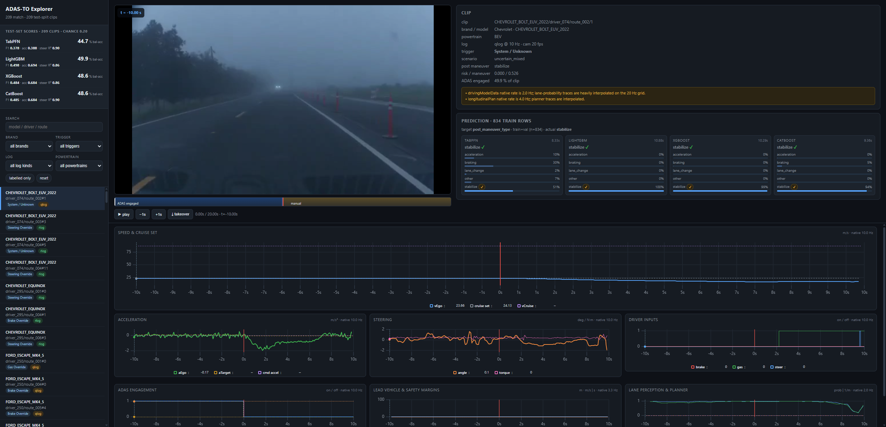

# ADAS-TO × TabPFN — takeover forecast explorer

Predict **what a driver does after an ADAS takeover** (and how hard) from the
**pre-takeover** signals only, on the [ADAS-TO](https://github.com/adas-to/adas-to)
sample. Ships a FastAPI explorer that scores the held-out test clips with four
models side by side, plus the experiments (code + saved results) behind it.

TabPFN is the headline model; LightGBM / XGBoost / CatBoost are the baselines.



## What's in here

| path | what |
|---|---|
| `src/adas_to/` | `config.py`, `model.py` (model factory), `splits.py` (train/val/test), `telemetry.py` (20 Hz clip decode) |
| `scripts/` | pipeline: build tables → split → evaluate → score → figures |
| `app/` | FastAPI backend (`server.py`) + single-page explorer (`static/index.html`) |
| `results/` | saved experiment metrics (JSON/CSV) and figures — no re-runs needed |
| `index/clip_manifest.csv` | clip inventory |
| `docs/PLAN.md` | full design notes and decisions |
| `results/experiments.pptx` | slide deck of the experiments (built from `results/`) |

## Setup

Requires **Python 3.11**.

```bash
python -m venv .venv
# Windows:  .venv\Scripts\activate      macOS/Linux:  source .venv/bin/activate

# GPU PyTorch (needed only for the vision/flow feature scripts):
pip install torch torchvision --index-url https://download.pytorch.org/whl/cu128

pip install -r requirements.txt
```

If you use TabPFN you must accept its one-time licence and set a token:

```bash
setx TABPFN_TOKEN "<your token>"     # https://ux.priorlabs.ai/account/licenses
```

Without a token, `make_model("auto")` falls back to LightGBM.

## Data

The ADAS-TO sample is **not** bundled (it is gated on Hugging Face). Download it
to `data/` and rebuild the derived tables:

```bash
python scripts/build_dataset.py          # -> data/derived/model_table.parquet, clip_index.parquet, schema.json
python scripts/build_splits.py           # -> data/derived/splits.parquet (train/val/test)
python scripts/build_forecast_table.py   # -> data/derived/forecast_table.parquet (sliding windows)
```

Optional feature families (require the GPU torch install):

```bash
python scripts/extract_vision_frames.py  &&  python scripts/build_vision_table.py
python scripts/extract_flow_frames.py    &&  python scripts/build_flow_table.py --method raft
```

## Run the explorer

```bash
python -m uvicorn app.server:app --host 127.0.0.1 --port 8077
# open http://127.0.0.1:8077
```

The explorer shows **test-split clips only** (driver-disjoint hold-out). Each clip
is predicted by all four models; `fit_mode="fit_with_cache"` keeps TabPFN fast
across repeated calls.

## Evaluate

```bash
python scripts/run_experiments.py        # driver-disjoint CV + brand-OOD -> results/m1_results.*
python scripts/score_test.py             # scores all 4 models on the test split -> results/test_scores.json
```

## Results (driver-disjoint test split, 209 clips)

| model | balanced accuracy | macro F1 | steer-torque R² |
|---|---|---|---|
| TabPFN | 0.447 | 0.378 | 0.899 |
| **LightGBM** | **0.499** | **0.498** | 0.861 |
| XGBoost | 0.486 | 0.484 | 0.864 |
| CatBoost | 0.486 | 0.485 | **0.901** |

Chance-level balanced accuracy is 0.20. LightGBM leads the maneuver class;
CatBoost/TabPFN lead the intensity regression. See `results/experiments.pptx`
and `docs/PLAN.md` for the full picture, including the vision and optical-flow
feature ablations (both null results).

## Notes

- Splits are **driver-disjoint** (`GroupKFold`) — the paper's protocol; brand-OOD
  is reported separately.
- `primary_trigger` / `trig_*` are excluded from features (they overlap the
  pre-window and would leak the label).
- The sample is routine, benign driving; the safety-critical tail is a separate
  problem (see `docs/PLAN.md`).
